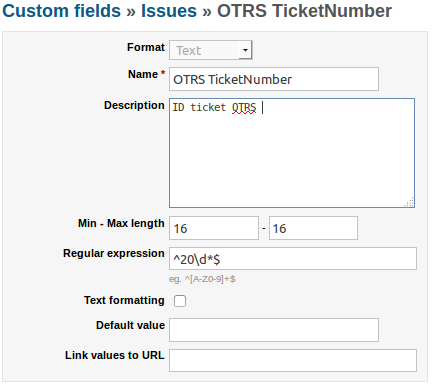
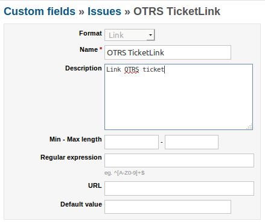
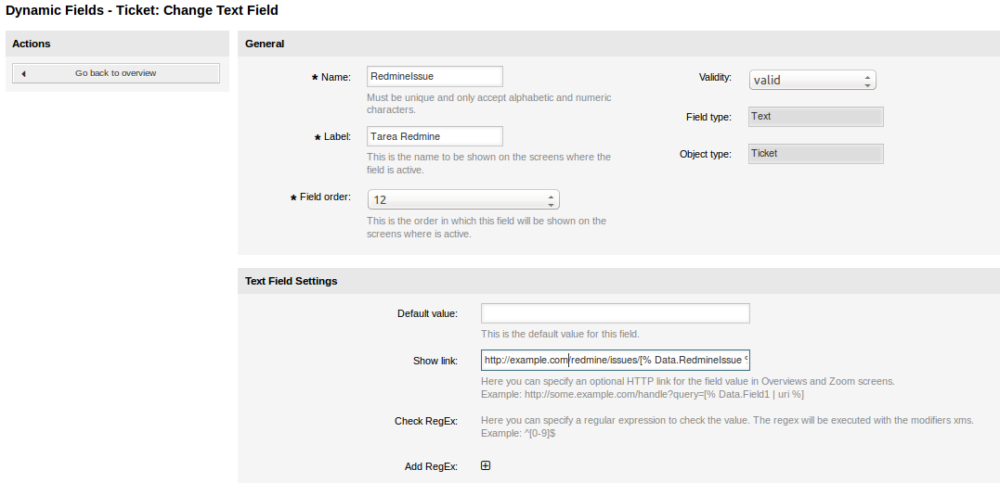
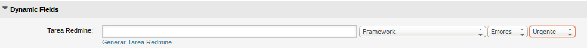
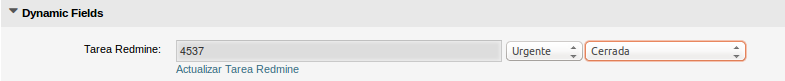
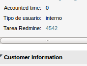
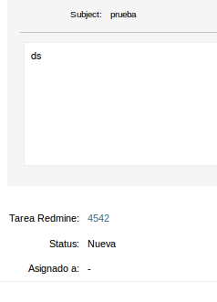

# otrs-redmine
A simple example how to create a Redmine issue in OTRS (and store it in a dynamic field).

Revised:
Redmine version 3.1.0.stable
OTRS  Version 4.0.6

Comment on the [Redmine forum](http://www.redmine.org/boards/2/topics/24573?r=28558)

###Custom Field in Redmine
* Create two Customs Fields in Redmine: 
     OTRS TicketNumber -- Type Text (RegExp --> ^20\d*$) 

     OTRS TicketLink -- Type Link 

###Configure Redmine
* Create user "otrs" with PostMaster Mail Account OTRS (assign the required projects)
* Enable "Authentication required", "Enable REST web service" and "Enable JSONP support" in Settings-->Authentication

###Dynamic Field in OTRS

First you need to add a dynamic field of type "Ticket" in OTRS.
Name it **RedmineIssue**.

Configure the URL to Task Redmine "http://example.com/redmine/issues/[% Data.RedmineIssue %]"

Configure visibility dynamic Filed in sysConfig OTRS (FreeText, TicketOverview, ViewZoom). 

###Add Field to AgentTicketActionCommon.tt

Add the code of the file [AgentTicketActionCommon.tt](Kernel/Output/HTML/Standard/AgentTicketActionCommon.tt) to your AgentTicketActionCommon.tt.

* Business version in Custom/Kernel/Output/HTML/Standard/AgentTicketActionCommon.tt
* Change [MYREDMINEAPIKEY] to your Redmine API Key. (this willl be needed for authorisation)
* Change [OTRSSERVER] to the hostname of your OTRS server.
* Change [OTRSTicketNumber] to number of your custom field "OTRS TicketNumber" in Redmine
* Change [OTRSTicketLink] to number of your custom field "OTRS TicketLink" in Redmine

###Configure your Redmine URL
* Open the Config File of OTRS (/opt/otrs/Kernel/Config.pm) and add 

    $Self->{redmine_url} = 'http://[myRedmineURL]';

###Add fields to AgentTicketZoom.tt
Add the code of [AgentTicketZoom.tt](Kernel/Output/HTML/Standard/AgentTicketZoom.tt) to your AgentTicketZoom.tt

* Maybe you have to copy the Template like you did with the AgentTicketActionCommon
* Change [MYREDMINEAPIKEY] to your Redmine API Key. (this willl be needed for authorisation)

###Screenshots
From FreeText tab
* Create task Redmine 

   Submit for index Redmine Task with OTRS Ticket

* Modify task Redmine

AgentTicketZoom provides view task Redmine in "Ticket Information" and tail of ticket 

###Redmine to OTRS
Changes in Redmine send mail to post PostMaster Mail Account OTRS and a new article will be created in the ticket.

Usage
=======
Just use it.

License
=======
Ehm... no

