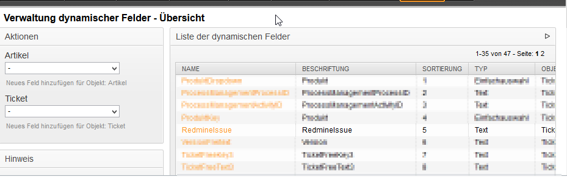
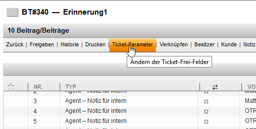
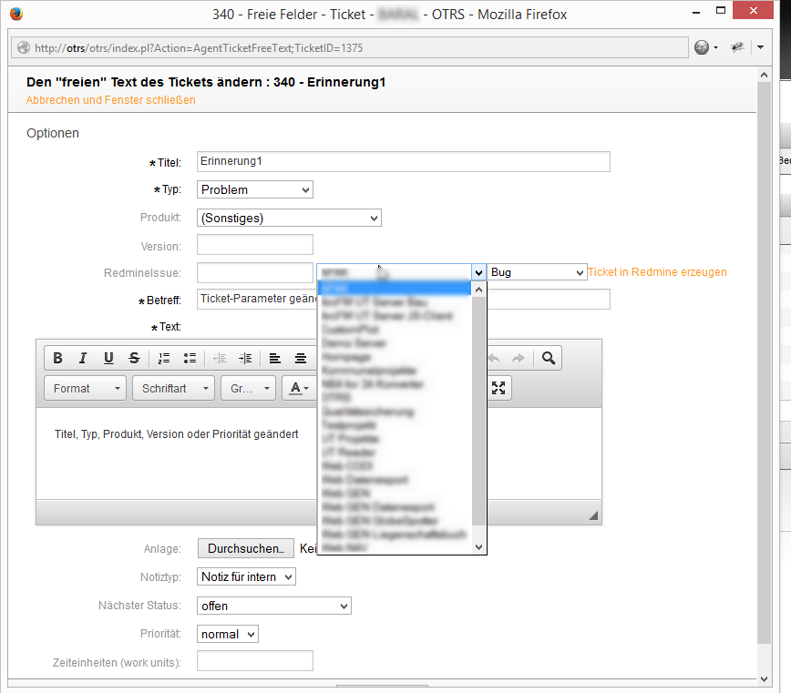

# otrs-redmine
A simple example how to create a Redmine issue in OTRS (and store it in a dynamic field).

3 years ago I wrote a comment on the [Redmine forum](http://www.redmine.org/boards/2/topics/24573?r=28558)

Now(!) I want to write down what I did.

###Custom Field in Remine
* Create a Custom Field (Text oder [Link](https://github.com/edavis10/redmine_url_custom_field))
 in Redmine.
###Dynamic Field

First you need to add a dynamic field of type "Ticket" in OTRS.
Name it **RedmineIssue**.

Config the URL to Reminde

###Add Field to AgentTicketActionCommon.dtl

Add the code of the file [AgentTicketActionCommon.dtl](templates/AgentTicketActionCommon.dtl) to your AgentTicketActionCommon.dtl.

* Maybe you have to copy the AgentTicketActionCommon.dtl in your "template" Folder (like /opt/otrs/Kernel/Output/HTML/[mytemplate]) 
* Change [MYREDMINEAPIKEY] to your Redmine API Key. (this willl be needed for authorisation)
* Change [OTRSSERVER] to the hostname of your OTRS server.
* Change the "2" in the createIssue function to ne number of your custom field in redmine

###Configure your Redmine URL
* Open the Config File of OTRS (/opt/otrs/Kernel/Config.pm) and add 

    $Self->{redmine_url} = 'http://[myRedmineURL]';

###Add fields to AgentTicketZoom.dtl
Add the code of [AgentTicketZoom.dtl](templates/AgentTicketZoom.dtl) to your AgentTicketZoom.dtl

* Maybe you have to copy the Template like you did with the AgentTicketActionCommon

###Screenshots
If everything worked :)

After the Ajax Request the Fields for the Projects an Trackers are filled...

The "Ticket in Redmine erzeugen" means "Create ticket in redmine" ... After a click the Ajax (Post) Request with the API Key and everything else is send to redmine ...

Usage
=======
Just use it.
License
=======
Ehm... no

